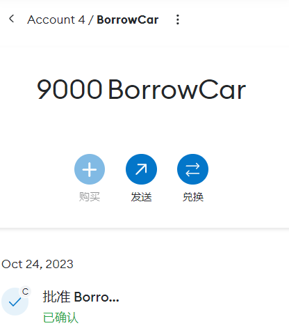

# ZJU-blockchain-course-2023
## 如何运行

1. 在本地启动ganache应用，新建一个工作目录，设置端口为8545

2. 在 `./contracts` 中安装需要的依赖，运行如下的命令：
    ```bash
    npm install
    ```
3. 在 `./contracts` 中编译合约，运行如下的命令：
    ```bash
    npx hardhat compile
    ```
4. 在 `./contracts` 中将合约部署到本地，运行如下命令：
    ```bash
    npx hardhat run ./scripts/deploy.ts --network ganache
    ```
5. 将输出的两个地址分别放到`./frontend/src/utils/contract-address.json`对应的地址中,将`./contracts/artifacts/contracts/BorrowYourCar.sol/BorrowYourCar.json`和`./contracts/artifacts/contracts/MyERC20.sol/MyERC20.json`放到`./frontend/src/utils/abis`下面覆盖   

6. 在 `./frontend` 中安装需要的依赖，运行如下的命令：
    ```bash
    npm install
    ```
7. 在 `./frontend` 中启动前端程序，运行如下的命令：
    ```bash
    npm run start
    ```

## 功能实现分析

1. 可以查看拥有的汽车列表，实现方法是在登录获取account之后，调用智能合约中的获取已拥有汽车的函数，更新本地的变量并显示
2. 可以查看当前没有被借用的汽车列表，实现方法在一开始和拥有的汽车一样，都是使用智能合约的函数。同时监听智能合约中的事件，每次调用借用的函数时都会emit这个事件，监听到了就更新列表，刷新显示
3. 可以查询汽车主人及借用者，和汽车列表一起显示。
4. 选择并借用某辆未被借用的汽车一定时间。只有未被借用的车才可以借用，点击借用之后输入借用时间，提交后将当前地址，汽车id，借用地址，借用时间传给智能合约的函数，然后触发事件
5. 使用自己发行的积分实现付费借车。首先每个人都可以获得10000积分，然后在借用时，先给Borrow的智能合约授权使用积分，然后在Borrow的函数中使用ERC20中的transferFrom进行转账

## 项目运行截图
### 初始页面

### 登录并领取积分以后

### 借用车辆

### 与钱包交互


### 支付之后的余额

### 借用之后，当前的积分以及可借用车列表

### 车主积分以及车辆信息


## 参考内容

- 课程的参考Demo见：[DEMOs](https://github.com/LBruyne/blockchain-course-demos)。

- ERC-4907 [参考实现](https://eips.ethereum.org/EIPS/eip-4907)

如果有其它参考的内容，也请在这里陈列。
